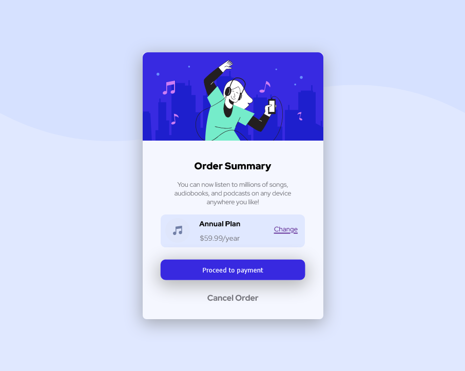

# Frontend Mentor - Order summary card

## Table of contents

- [Overview](#overview)
  - [The challenge](#the-challenge)
  - [Screenshot](#screenshot)
  - [Links](#links)
- [My process](#my-process)
  - [Built with](#built-with)
  - [What I learned](#what-i-learned)
- [Author](#author)

## Overview
### The challenge

The challenge is to make an Order summary card same as the one in the design folder that came with the challenge.

### Screenshot

### links

- Live Site URL: (https://blissful-swanson-30f428.netlify.app/)

##My process

### Built with

- Semantic HTML5 markup
- CSS custom properties
- Flexbox

### What I learned

What i learned is I have a lot more to learn on media query

## Author

-Frontend Mentor - [@Nebil-Nej] (https://www.frontendmentor.io/profile/Nebil-Nej)
